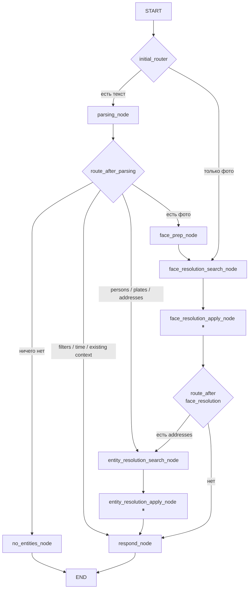

# Graph Overview

Топология LangGraph StateGraph. `thread_id = chat_id`.

```mermaid
flowchart TD
    START --> IR{"initial_router"}

    IR -->|"есть текст"| PN[parsing_node]
    IR -->|"только фото"| FRS

    PN --> RAP{"route_after_parsing"}

    RAP -->|"ничего нет"| NE[no_entities_node]
    RAP -->|"filters / time / existing context"| RN

    FP --> FRS[face_resolution_search_node]
    FRS --> FRA[face_resolution_apply_node ⏸]
    FRA --> RAF{"route_after\nface_resolution"}

    RAF -->|"есть addresses"| ERS
    RAP -->|"persons / plates / addresses"| ERS
    RAF -->|"нет"| RN
    RAP -->|"есть фото"| FP[face_prep_node]

    ERS[entity_resolution_search_node] --> ERA[entity_resolution_apply_node ⏸]
    ERA --> RN[respond_node]

    NE --> END
    RN --> END
```

