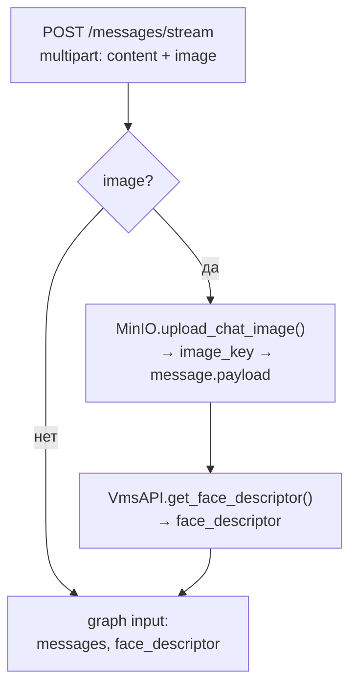
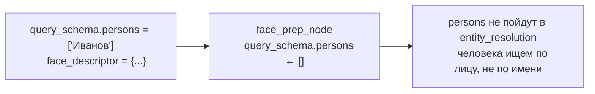
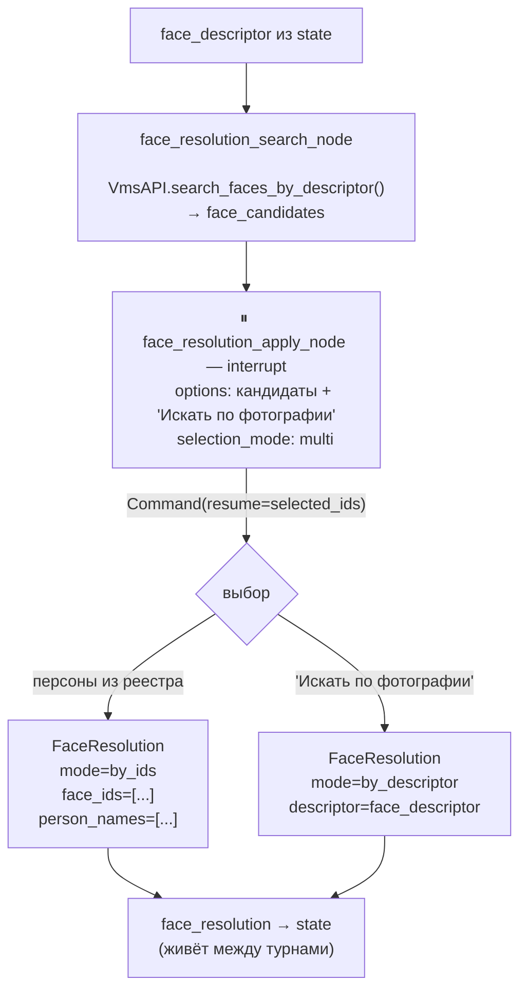
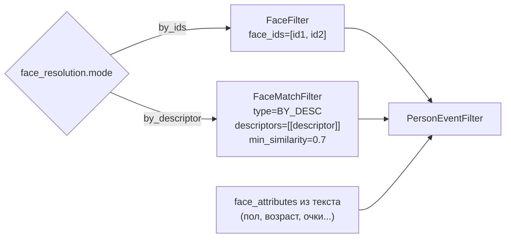
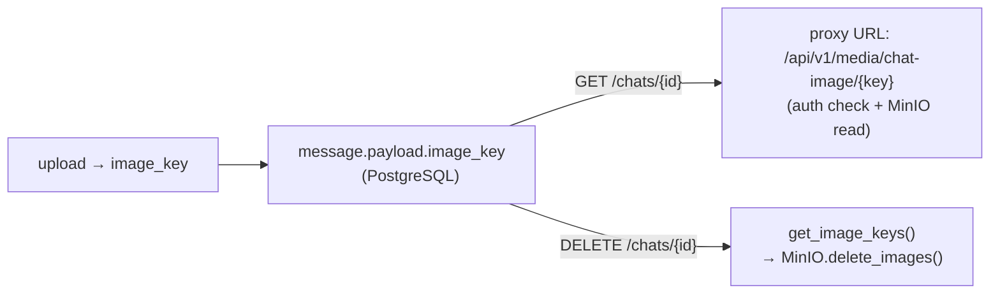

# Фото-трек

## До графа (service.py)

---

## face_prep_node (text + photo)

---

## face_resolution

> Выбор одновременно персон и "Искать по фотографии" — ошибка 400.

---

## face_resolution → EventFilter

`face_resolution` приоритетнее `selected_entities` для персон.

---

## Жизненный цикл image_key

