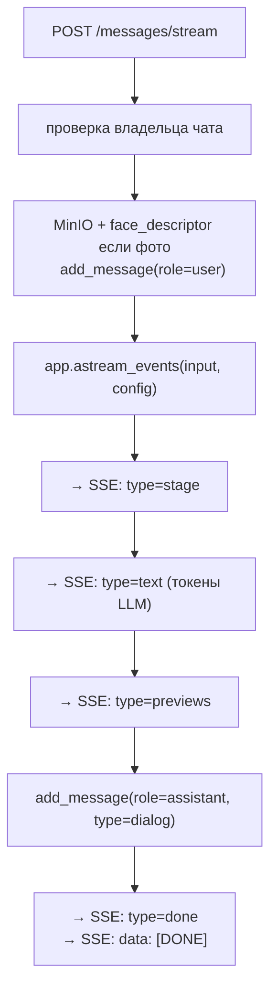
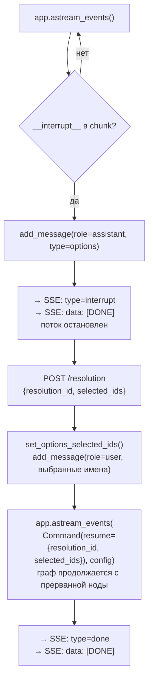

# Service & SSE

## Нормальный поток (без interrupt)

---

## Поток с interrupt и resume

---

## SSE события — справочник

| Событие | Когда | Ключевые поля |
|---------|-------|------|
| `stage` | старт ноды | `stage: parsing\|resolution\|face_resolution\|respond` |
| `text` | токен от LLM | `content: str` |
| `interrupt` | нужен выбор | `resolution_id, entity_type, selection_mode, options` |
| `previews` | конец respond_node | `vms_link, vms_links, event_previews` |
| `done` | конец графа | `vms_link, vms_links, vms_request, event_previews` |
| `error` | timeout 300s или другая ошибка обработки | `content: str` |
| `[DONE]` | всегда в конце | sentinel |

---

## Что сохраняется в БД

| Момент | role | type | payload |
|--------|------|------|---------|
| до графа | `user` | `dialog` | `{image_key}` если фото |
| interrupt | `assistant` | `options` | `{resolution_id, entity_type, selection_mode, options}` |
| resume | `user` | `dialog` | — |
| конец графа | `assistant` | `dialog` | `{vms_link, vms_links, vms_request, event_previews}` |
