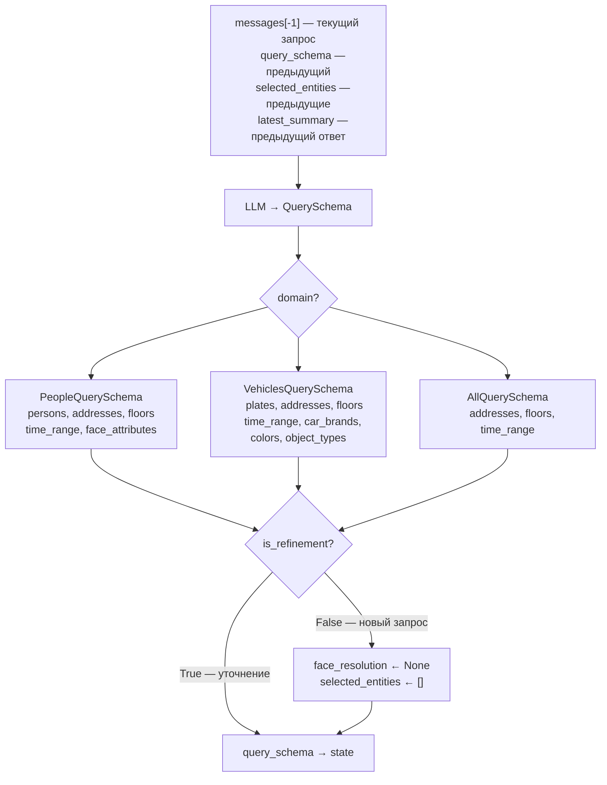
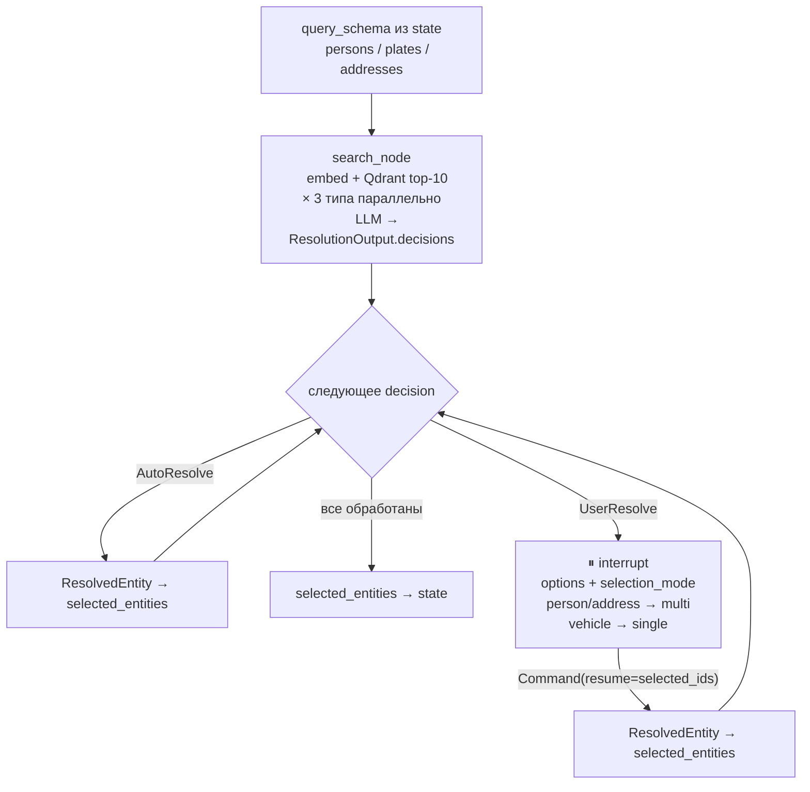
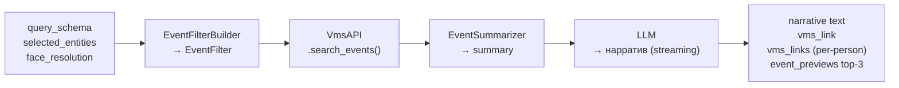

# Текстовый трек

## parsing_node

```mermaid
flowchart TD
    IN["messages[-1] — текущий запрос
    query_schema — предыдущий
    selected_entities — предыдущие
    latest_summary — предыдущий ответ"]

    IN --> LLM["LLM → QuerySchema"]

    LLM --> QS{"domain?"}
    QS --> P["PeopleQuerySchema
    persons, addresses, floors
    time_range, face_attributes"]
    QS --> V["VehiclesQuerySchema
    plates, addresses, floors
    time_range, car_brands, colors, object_types"]
    QS --> A["AllQuerySchema
    addresses, floors, time_range"]

    P & V & A --> REF{"is_refinement?"}
    REF -->|"False — новый запрос"| CLEAR["face_resolution ← None
    selected_entities ← []"]
    REF -->|"True — уточнение"| OUT
    CLEAR --> OUT["query_schema → state"]
```

---

## entity_resolution

```mermaid
flowchart TD
    QS["query_schema из state
    persons / plates / addresses"]

    QS --> SEARCH["search_node
    embed + Qdrant top-10 × 3 типа параллельно
    LLM → ResolutionOutput.decisions"]

    SEARCH --> LOOP{"следующее decision"}

    LOOP -->|"AutoResolve"| AUTO["ResolvedEntity → selected_entities"]
    AUTO --> LOOP

    LOOP -->|"все обработаны"| DONE["selected_entities → state"]
    LOOP -->|"UserResolve"| INT["⏸ interrupt
    options + selection_mode
    person/address → multi
    vehicle → single"]

    INT -->|"Command(resume=selected_ids)"| APPLY["ResolvedEntity → selected_entities"]
    APPLY --> LOOP

```

---

## respond_node

```mermaid
flowchart LR
    IN["query_schema
    selected_entities
    face_resolution"] --> EF["EventFilterBuilder
    → EventFilter"]

    EF --> VMS["VmsAPI
    .search_events()"]

    VMS --> SUM["EventSummarizer
    → summary"]

    SUM --> LLM["LLM
    → нарратив (streaming)"]

    LLM --> OUT["narrative text
    vms_link
    vms_links (per-person)
    event_previews top-3"]
```

